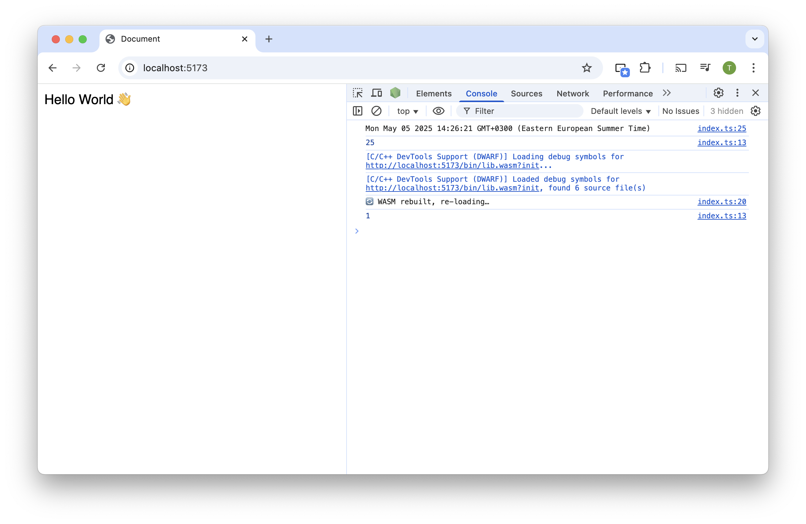

# zig-wasm-hmr



Example setup of HMR (hot-module-reloading) of Zig WASM lib with Vite.

## Install

```bash
bun i # Can also use NPM or any other package manager.
```

## Start

```bash
bun vite
```

## How to use it?

Edit the return of `version()` function in `zig/root.zig` file. You will see that the WASM module automatically compiled and refresh.
